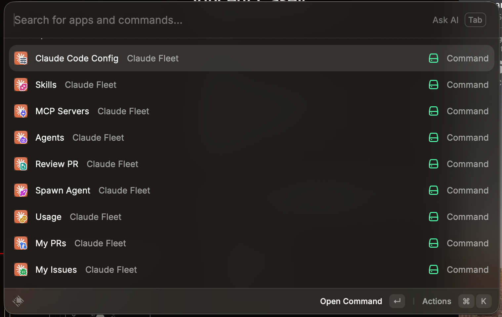

<div align="center">


<p>
  <a href="https://github.com/vmc-7645/claude-fleet/actions/workflows/ci.yml"></a>
  
  
  
  
</p>

See your Claude Code agents, PRs, and worktrees in Raycast — and hand any of them
to an agent in one keystroke. Plus an ambient menu-bar read on **who needs you**.

</div>

---

> [!NOTE]
> **Built and in daily use** as a local Raycast dev extension. Full design in **[SPEC.md](SPEC.md)**.
> **Liveness needs no hooks** — the extension reads Claude Code's *own* session registry
> (`~/.claude/sessions`) directly, so active agents show up out of the box. The bundled
> [helpers](helpers/) add the richer touches (Focus Tab, per-turn state, Spawn, Undo).

## The `→ Claude` primitive

Every dev surface — a PR, an issue, a running agent, a past session, a worktree — carries a
one-keystroke **hand it to an agent** action. That's the whole idea: stop context-switching to
a terminal to start work; start it from wherever you already are.

## Commands

Fifteen commands, grouped by what you reach for.

#### 🤖 Agents & fleet
| Command | Mode | What it does |
|---|---|---|
|  **Agents** | list | Active (live) + Recent (history) console. Per agent: **Focus Tab** (jumps to the exact Ghostty tab), Resume, Fork, **Nudge** / **Quick Reply** (send a canned follow-up into its tab), **Close Tab**, Undo last turn, Stop, open in editor/folder. Detail pane (⌘I) shows the pending question + mode/state/diff. **Scope** dropdown (All / Active / Recent / per-repo). |
|  **Next Waiting Agent** | hotkey | Focus the agent that's been waiting on you longest — hit it again to work through the backlog. **Opt-in:** off by default; enable it and assign a hotkey. |
|  **Contexts** | list | Search every past session by **what was said in it** — not just its title. Words are ANDed, `"quote"` for a phrase. Scope by **branch** (`branch:feat/x`), repo, or `is:live`; the dropdown shows a branch → count roster. Rows carry the branch, `+N` when the session spanned more, 🍂 merged, ⚠️ gone. Resume / Fork / Focus Tab from any hit. |
|  **Fleet** | menu bar | Needs-you count badge + roster; click an agent to focus its tab. Refreshes every minute. |

#### 🔀 PRs, issues & worktrees
| Command | Mode | What it does |
|---|---|---|
|  **My PRs** | list | Your cross-repo open PRs with **CI status** (✅ / ❌ / ⏳). Per PR: **Review in Claude**, **Check Out & Work**, **Resume PR agent** (`--from-pr`). |
|  **PRs to Review** | list | PRs where someone **requested your review** (cross-repo, with CI + author) → **Review in Claude** (`/review`), cloning the repo on demand. |
|  **My Issues** | list | Cross-repo open issues → start an agent seeded with the issue. |
|  **Review PR** | form | Type a PR number + pick a repo → `claude /review`. |
|  **Worktrees** | list | Worktrees across repos; open / resume / **remove**; merged branches flagged 🍂. |

#### 🚀 Spawn & start
| Command | Mode | What it does |
|---|---|---|
|  **Spawn Agent** | form | Repo + task (+ optional branch) → agent in a fresh worktree, seeded with the task. |
|  **New Session** | form | Fresh Claude session in a repo (no worktree). |

#### ⚙️ Manage Claude Code
| Command | Mode | What it does |
|---|---|---|
|  **MCP Servers** | list | Configured servers + live auth status; re-authenticate via `/mcp`. |
|  **Skills** | list | Manage your custom slash-command skills — edit, enable/disable, create. |
|  **Usage** | list | Estimated tokens & cost per session (today vs earlier), at API rates. |
|  **Claude Code Config** | list | Edit settings / CLAUDE.md, inspect hooks / plugins, set model, run `doctor`, show version. |

> Repo pickers (Review PR · New Session · Spawn) are recency-sorted: your **local** repos first,
> then everything you can access on **GitHub** — remote picks are cloned on demand.

## Screens

<p align="center"></p>

<p align="center"><sub>The Claude Fleet commands in Raycast.</sub></p>

## Setup

**Prerequisites:** macOS · [Raycast](https://raycast.com) · [Claude Code](https://claude.com/claude-code) · [`gh`](https://cli.github.com) · `git` · `jq` · a terminal ([Ghostty](https://ghostty.org) recommended)

```sh
# 1 — clone
git clone https://github.com/vmc-7645/claude-fleet.git && cd claude-fleet

# 2 — install the shell helpers + hooks (idempotent; wires ~/.claude/settings.json, backs it up first)
helpers/install.sh

# 3 — sign in to GitHub (for My PRs / PRs to Review / My Issues)
gh auth login

# 4 — load the extension into Raycast (persists after you stop the dev server)
cd extension && npm ci && npm run dev
```

Then two one-time steps:

1. **Restart Claude Code** so the new hooks load.
2. **Grant Raycast Accessibility** — System Settings → Privacy & Security → Accessibility → enable
   **Raycast**. Needed for the tab-focus / keystroke actions; `gh` reads work without it.

That's it — open Raycast and search **Claude Fleet**.

<details>
<summary><strong>Preferences</strong> (Raycast → Extensions → Claude Fleet → ⚙️)</summary>

<br>

- **Terminal** — where agents open: **Ghostty** (default), iTerm2, or Apple Terminal.
  Focus Tab / Nudge / Close Tab need Ghostty (per-tab accessibility); every other
  action (Resume, Fork, Review, Spawn, New Session…) works on any of them.
- **Agent primary action** — Focus Tab vs Resume in New Tab (what Enter does on a live agent).
- **Quick replies** — comma-separated canned follow-ups for the Quick Reply action.
- **Editor command** — `code` / `cursor` / … for *Open in Editor* (must be on `PATH`).
- **Repos directory** — override discovery root. Blank → `~/.config/claude-fleet/repos.env` → `~/Repos`.

</details>

## Under the hood

The extension is a thin, declarative UI over a few data sources it reads directly — no daemon,
no polling service, nothing to keep running.

<p align="center"></p>

<details>
<summary><strong>Where each fact comes from</strong></summary>

<br>

| Source | Gives |
|---|---|
| `~/.claude/sessions/*.json` | **Active** agents — Claude's own live registry (sessionId · cwd · pid · busy/idle). Authoritative liveness, **no hooks needed**. |
| `~/.claude/projects/*.jsonl` | **Recent** sessions — title (`aiTitle`), pending question (last assistant message), turn count, token usage. Parsed metadata is cached by file mtime. |
| `~/.claude/fleet/*.json` | Optional enrichment from the `fleet-register` hook — finer state (waiting / done), task label, diff, mode. |
| `gh` | Cross-repo PRs & issues, CI rollup, remote repo list. |

</details>

The local commands + hooks the extension drives are vendored in **[`helpers/`](helpers/)**
(`claude-worktree`, `claude-undo`, `claude-restore`, and the `tab-status` / `fleet-register` /
`checkpoint` hooks) — see [helpers/README](helpers/README.md). The extension degrades gracefully
without them: Focus Tab falls back to raising the terminal; Spawn / Undo report the missing command.

## Focus Tab — how it works

The `tab-status` hook titles each Ghostty tab `<emoji> <repo>:<branch> — <task>`. Ghostty exposes
tabs as a native `AXTabGroup` of `AXRadioButton`s (titles = those strings), so the extension
matches an agent to its tab by `repo:branch` and `AXPress`es it — jumping you straight there
(even across Spaces for a fullscreen window). No match → it raises the terminal.

## Requirements

macOS · a terminal — [Ghostty](https://ghostty.org) (default, and required for
Focus Tab / Nudge / Close Tab), iTerm2, or Apple Terminal · Claude Code ·
[`gh`](https://cli.github.com) (My PRs / PRs to Review / My Issues) · `git` · `jq` (the `helpers/` hooks).

## License

[MIT](LICENSE). The Claude marks in `extension/assets/` are Anthropic's trademarks — see
[assets/NOTICE](extension/assets/NOTICE.md). Not affiliated with Anthropic.
